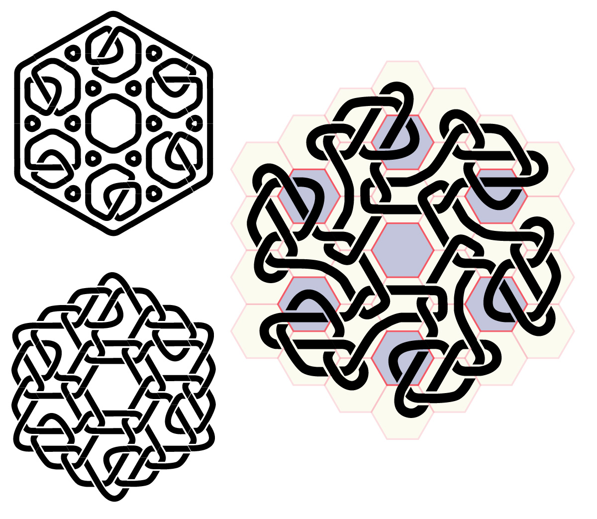

# KnotConLang — Primer

This is a visual writing system where meaning is encoded in the geometry of hexagonal knotwork. A sentence is a row of hex cells; each cell is a single word; the shape of the knot *is* the word.

---

## The Output

The program outputs sequences of **HIBOX ligature codes** — strings of the characters `H`, `I`, `B`, `O`, `X`. Installed with ligatures enabled, the hex knot fonts render each such sequence as a knotwork glyph. The raw text is human-readable as a phonetic notation; the rendered font output is the intended visual form.

Each word is a **six-character code**, one character per wall of the hexagonal cell, read clockwise from the top: North, NE, SE, South, SW, NW.

```
        N
    NW     NE
    SW     SE
        S
```

Each wall takes one of three values:

| Character | Meaning at that wall |
|-----------|----------------------|
| `O`       | Open — no thread crosses here |
| `I`       | Inline — thread passes straight through |
| `X`       | Cross — thread crosses over/under here |

(`H` and `B` are variants of `X` — mirror images of a crossing — used by the knot-generation engine but not by the language encoder.)

A word like `XOOXOO` therefore describes a specific pattern of connections across the six walls of one hex cell. That pattern is the word.

---

## The Language

### Architecture

The language has exactly **729 ideograms** — 3⁶, the number of distinct six-trit sequences over {O, I, X}. This ceiling is intentional. Polysemy is a feature: roots are chosen precisely because they earn their place across multiple domains and case-forms, not because they map cleanly to one English word.

The 729 ideograms arise from **81 roots × 9 cases**.

- **81 roots** = 3⁴ — four trits of semantic content (root positions 1–4 in the six-character word).
- **9 cases** = 3² — two trits of grammatical role (case positions interleaved into the word as positions 1 and 3).

The interleaving format is: `[case-trit-1][root-trits-1,2][case-trit-2][root-trits-3,4]`

So the word `XOOXOO` breaks as: case-trit-1=`X`, root=`OOOO`, case-trit-2=`X` → root `OOOO` (CAESURA, index 0) in case `XX` (nominative) — i.e. PUNC.QUER, a query mark (`?`). For a content root: WIND is `OOOI` (index 1), so WIND[nom] encodes as `XOOXOI`.

### Roots

There are 80 content roots plus **CAESURA**, which functions as punctuation rather than semantic content (see below). Roots are chosen as **semantic primitives**: concepts that are maximally generative across case-forms and resistant to being derived from other roots via kenning.

Some examples from the root set:

```
WIND    FIRE    WATER   EARTH   SKY     LIGHT   NIGHT   DAY
GROUND  ROOT    EDGE    BODY    HAND    EYE     EAR     MOUTH
HEART   BONE    SKIN    BLOOD   BREATH  VOICE   MOVE    PATH
GIVE    HOLD    BREAK   KNOW    FEAR    FEEL    HIDE    REAP
ONE     MANY    NOT     ALIKE   BETWEEN CIRCLE  FIELD   TIME
SPACE   PRIOR   NEXT    LEVEL   POINT   SMALL   LARGE   WEIGHT
...
```

### Cases

The two case trits together select one of nine grammatical/semantic roles. The same root in a different case is a different word with a related but distinct meaning — the case system is the primary engine of polysemy.

| Case | Abbrev | Trit code | Role |
|------|--------|-----------|------|
| Nominative  | `nom` | `XX` | The thing itself; unmarked; subject position |
| Accusative  | `acc` | `OI` | As object; receiving action |
| Genitive    | `gen` | `IO` | As source, possessor, or material |
| Agentive    | `agt` | `OX` | As agent; the thing that acts |
| Locative    | `loc` | `II` | As place, context, or frame |
| Adjectival  | `adj` | `IX` | As quality or modifier |
| Transitive  | `trn` | `XO` | As transitive action (takes an object) |
| Intransitive| `int` | `XI` | As intransitive action (no object) |
| Abstract    | `abs` | `OO` | As archetype, essence, or pure concept |

For example, WATER[nom] = water (the substance); WATER[adj] = watery, fluid; WATER[trn] = to water (something); WATER[abs] = the concept of water, liquidity as an archetype.

### Kennings

Complex words are built by compounding roots into **kennings**. The rules are:

**1. Head-last.** The final element is the semantic head (the genus). Earlier elements differentiate.

```
FISH  = WATER · ANIMAL    — "the animal of water"
DOG   = WATCH · PET       — "the pet defined by watching/guarding"
CLOUD = SKY · KNOT        — "a knot in the sky"
```

**2. Case inheritance.** Non-terminal elements default to nominative. The terminal element inherits the live case from context. Fixed-case elements (written as `WORD.case` in input) override this.

```
FISH.gen  → WATER[nom] · ANIMAL[gen]   — "of a fish"
FISH.int  → WATER[nom] · ANIMAL[int]   — "to fish (intransitively)"
```

**3. Doubling = intensification or superlative.**

```
TINY      = SMALL · SMALL
HUGE      = LARGE · LARGE
FOREST    = TREE  · TREE
SURE      = KNOW  · KNOW
PRIMORDIAL = PRIOR · PRIOR
```

**4. Swapped-head pairs.** The same two roots in reversed order produce related but distinct concepts.

```
SOURCE = STRING · ROOT    — origin from which a thread runs
ORIGIN = ROOT   · STRING  — the root that a string comes from
ORE    = REAP   · METAL   — metal as the thing harvested
MINE   = METAL  · REAP    — reaping as directed at metal
```

**5. ALIKE as quality extractor.** `X · ALIKE` in non-terminal position means "having the quality of X", allowing concrete roots to produce adjectival qualities.

```
HARD   = METAL · ALIKE · FEEL   — the feel of metal-quality
FLUID  = WATER · ALIKE · FEEL   — the feel of water-quality
SHADOW = NIGHT · ALIKE          — night-like (used as a modifier)
```

**6. NOT as scope operator.** NOT ranges across all nine cases, each producing a different nuance.

```
NOT[adj] = un-, soft  (SOFT = NOT[adj] · POINT — "un-pointed")
NOT[acc] = other-as-object  (YOU = NOT[acc] · SELF — "the not-self that is addressed")
NOT[abs] = abstract other   (IT  = NOT[abs] · SELF)
```

### CAESURA

CAESURA is the 81st root — it does not carry semantic content. Instead, it maps case-codes to punctuation marks:

| Case code | Punctuation | Function |
|-----------|-------------|----------|
| `OO` (abs) | `.` | End of statement |
| `OI` (acc) | `'` | Closer — "is what was said" |
| `IO` (gen) | `'` | Opener — "she said:…" |
| `IX` (adj) | `,` | Also / unordered conjunction |
| `XI` (int) | `;` | Then / ordered sequence |
| `II` (loc) | `:` | In other words / zoom-in |
| `XO` (trn) | `∴` | Causal break — because / therefore |
| `OX` (agt) | `→` | If/when / conditional |
| `XX` (nom) | `?` | Interrogative |

So a sentence ends with `CAESURA.abs`, a causal clause break with `CAESURA.trn`, and so on.

---

## Reading a Knot

Each hex cell in a line of text holds one ideogram. Reading column by column — top to bottom within each column, left to right across columns — you encounter one word per cell. Cells that are unmined (part of the structural background knotwork rather than encoded text) have a different visual signature — a complete open cell renders as six `O`s, which the renderer shows as a blank or a background knot.

The six-character code for any word can be looked up or decoded:
1. Split the code as `[c₁][r₁r₂][c₂][r₃r₄]`.
2. The root trits `r₁r₂r₃r₄` identify the root (index into the 81-root table).
3. The case trits `c₁c₂` identify the case (one of the nine above).

---

### Knot Leipzig Gloss Key

#### Morphological Encoding

Ideogram positions `CRRCRR` (0–5, clockwise from North):

```
Case = position 0 + position 3
Root = positions 1, 2, 4, 5
Gloss order: ROOT-CASE  (e.g. WIND-NOM)
```

Abbreviation convention: internal shorthands are lowercase (`nom`, `abs`, `int`); Leipzig-style glosses in this section are uppercase (`NOM`, `ABT`, `INTR`). Two deliberate divergences from standard Leipzig: **`ABT`** (abstract archetype) is distinct from Leipzig `ABS` (absolutive); **`INTR`** corresponds to the internal shorthand `int`.

#### Case Morphemes

| Trit code | Internal | Leipzig | Role |
|-----------|----------|---------|------|
| `OO`      | `abs`    | `ABT`   | Abstract / citation form / pure conceptual archetype |
| `OI`      | `acc`    | `ACC`   | Accusative / object / patient |
| `OX`      | `agt`    | `AGT`   | Volitional actor (cf. Leipzig A.; not restricted to transitive) |
| `IO`      | `gen`    | `GEN`   | Genitive / possessive / relational |
| `II`      | `loc`    | `LOC`   | Locative / position / boundary |
| `IX`      | `adj`    | `ADJ`   | Adjectival / attributive modifier |
| `XO`      | `trn`    | `TRN`   | Transitive verb |
| `XI`      | `int`    | `INTR`  | Intransitive verb |
| `XX`      | `nom`    | `NOM`   | Nominative / default subject |

#### Punctuation (PUNC)

Root `OOOO` (CAESURA, index 0) carries no semantic content; case alone determines punctuation function.

```
OO = PUNC.END    .   end of statement
OI = PUNC.CLOS   '   quotative closer
OX = PUNC.COND   →   conditional / if-when
IO = PUNC.OPEN   '   quotative opener
II = PUNC.ELAB   :   elaboration / in other words
IX = PUNC.CORD   ,   co-ordination / unordered
XO = PUNC.CAUS   ∴   causal break / therefore
XI = PUNC.SEQN   ;   sequence / ordered
XX = PUNC.QUER   ?   interrogative
```

`OOOOOO` = OOOO-OO = PUNC.END (`.`)  
`XOOXOO` = OOOO-XX = PUNC.QUER (`?`)

#### Reading Order

Text is encoded **column-major**: top to bottom within each odd display column, columns read left to right. Each ideogram cell is itself read clockwise from the top (N → NE → SE → S → SW → NW), with O for no thread, I for parallel, X for crossed.

#### Compound Structure

Internal joints default to NOM. Non-NOM internal cases are lexically frozen and marked explicitly.

```
WATER.NOM ANIMAL.NOM → FISH.NOM   "the fish"
WATER.NOM ANIMAL.LOC → FISH.LOC   "at/to the fish"
```

#### Proper Nouns

Personal names and toponyms frame an identifying root between doubled markers:

```
NAME · [root] · NAME    personal name
PLACE · [root] · PLACE  toponym
```

#### Example

```
OOOXOX OOXOXO XOOOXO OOOOOO
OXOXOO OXOOOX XOXOOO
```

```
OOOX-OX    OXXO-OO      OOXO-XO      OOOO-OO
MAN-AGT    GIVE-ABT     SIBLING-TRN  PUNC.END
man.AGT    offers.ABT   sibling.TRN  .
"Man offers brotherhood."

XOOO-OX    XOOX-OO      OXOO-XO
WOMAN-AGT  REAP-ABT     CHILD-TRN
woman.AGT  harvest.ABT  child.TRN
"Woman harvests childhood."
```


## Design Notes

The 729-ideogram ceiling is fixed by geometry: a hex cell has six walls, each taking three values. This is not a limitation to work around — it is the constraint that makes the system a *language* rather than a catalog. Every root must earn its place by being productive across multiple case-forms and kenning combinations. Concepts that can be derived from existing roots via kenning should be, rather than consuming a root slot.

The language is **somatic and relational**: most abstract concepts are grounded in bodily or environmental experience. GRIEF = METAL·HEART (the weight of metal on the heart). PEACE = HEART·MEND. KNOWLEDGE = HOLD·KNOW. This is a design choice, not an accident — the visual medium suits concepts that have weight and texture.
